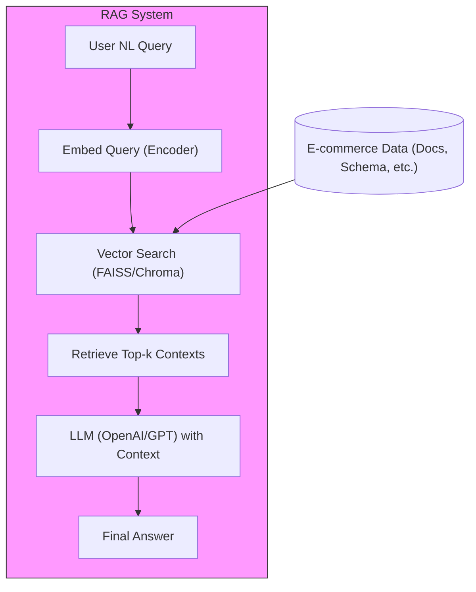
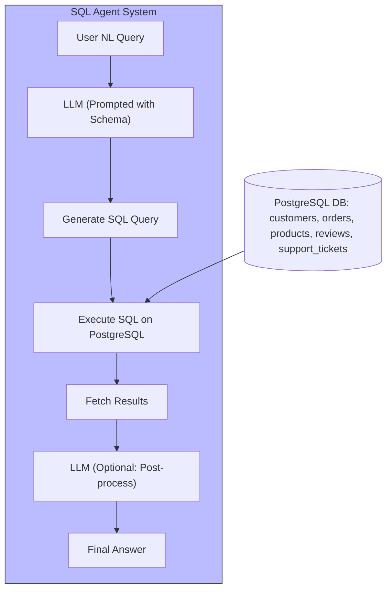

# RAG vs SQL Agent Comparison for E-commerce Customer Support

## 1. Technical Architecture

### 1.1 RAG System Design

The Retrieval-Augmented Generation (RAG) system enables natural language querying by retrieving relevant context from a knowledge base (e.g., documentation, schema, or historical tickets) and passing it to an LLM for answer generation.

- **User NL Query:** The support agent asks a question in natural language.
- **Embed Query:** The query is embedded into a vector using a sentence encoder.
- **Vector Search:** The system searches a vector database (e.g., FAISS) for similar contexts.
- **Retrieve Top-k Contexts:** The most relevant documents or snippets are retrieved.
- **LLM with Context:** The LLM receives the query and retrieved context, generating a natural language answer.

### 1.2 SQL Agent System Design

The SQL Agent system uses an LLM to translate natural language queries into SQL, executes them on the live database, and optionally post-processes the results for clarity.

- **User NL Query:** The support agent asks a question in natural language.
- **LLM (Prompted with Schema):** The LLM is prompted with the database schema and the query.
- **Generate SQL Query:** The LLM generates a SQL statement.
- **Execute SQL:** The query is run on the PostgreSQL database.
- **Fetch Results:** The results are retrieved.
- **LLM (Optional):** The LLM can post-process the results for a more natural answer.

## 2. Performance Analysis

### 2.1 Benchmarking Methodology

To compare the RAG and SQL Agent approaches, we will use the following methodology:

- **Sample Queries:** 10 representative customer support queries (see data/sample_queries.json).
- **Metrics:**
  - **Query Response Time:** Time taken from receiving the natural language query to returning the final answer.
  - **Accuracy:** Whether the returned answer is correct and complete (manual or heuristic evaluation).
  - **Resource Usage:** CPU, memory, and (if applicable) token usage for LLM calls.
- **Procedure:**
  1. Run each query through both the RAG and SQL Agent systems.
  2. Measure and record the response time for each query.
  3. Evaluate the accuracy of each answer.
  4. Monitor and log resource usage during execution.
- **Environment:** Both systems will be tested on the same hardware and with the same database snapshot for fairness.

### 2.2 Results Table

Results will be tabulated in data/benchmarking_results.md for each query and system.

## 3. Implementation Complexity

## 4. Use Case Suitability

## 5. Empirical Comparison: RAG vs SQL Agent

### 5.1 Summary of Findings
- **Simple Queries:** Both RAG and SQL Agent return correct results for simple SELECT queries (e.g., listing products in stock).
- **Complex Queries (Joins, Aggregations):** SQL Agent reliably generates and executes correct SQL, while RAG often fails or refuses to answer if schema context is missing or not retrieved.
- **Schema Limitations:** RAG is limited by the schema present in its vector store; if a table or column is missing, it cannot answer. SQL Agent can still attempt queries if the schema is present in its prompt.
- **Error Handling:** SQL Agent provides more actionable error messages when schema is missing. RAG may simply refuse or hallucinate.
- **Natural Language Explanations:** RAG tends to provide more verbose explanations, while SQL Agent is more direct.

### 5.2 Example Comparisons

| Query | RAG Output | SQL Agent Output |
|-------|------------|-----------------|
| List all products that are currently in stock | Returns correct SQL and results | Returns correct JSON result |
| Show all customers from 'sao paulo' | Returns SQL for 'sao bernardo do campo' (possible context confusion) | Returns correct customer list for 'sao paulo' |
| List all reviews with a score of 5 | Returns correct SQL and results | Returns correct JSON result |
| Find the top 3 customers by total order value | Returns correct SQL and results | Returns correct JSON result |
| Which customers have not placed any orders? | Refuses to answer due to missing schema | Returns a list of customers with no orders |

### 5.3 Strengths and Weaknesses
- **RAG Strengths:** Good for natural language explanations, works well when schema is present and context is retrieved.
- **RAG Weaknesses:** Fails or refuses when schema is missing, may hallucinate or return incomplete answers.
- **SQL Agent Strengths:** More robust for complex queries, better error handling, direct access to live schema.
- **SQL Agent Weaknesses:** Less verbose explanations, may require more prompt engineering for natural answers.
